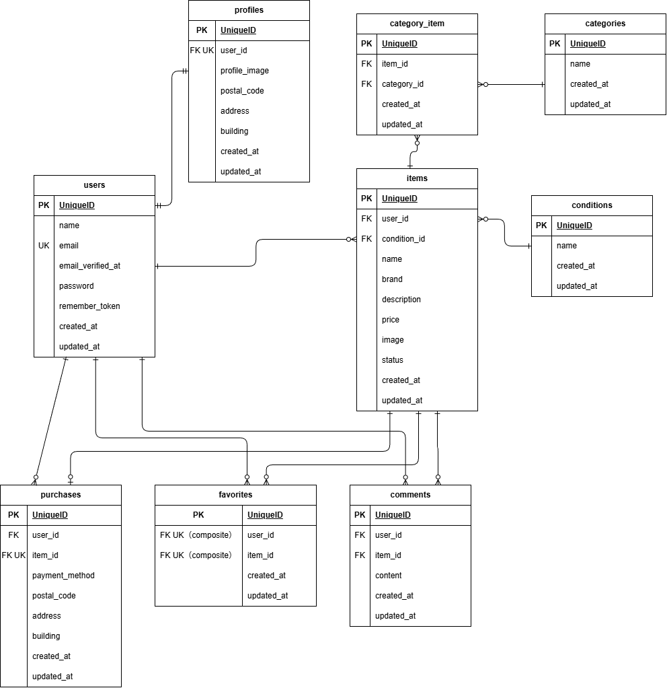

# coachtech フリマ

coachtech ブランドのフリーマーケットアプリケーションです。ユーザー間で商品の出品・購入・お気に入り登録・コメントが行えます。

## アプリケーション URL

- 開発環境: <http://localhost>
- phpMyAdmin: <http://localhost:8080>
- MailHog: <http://localhost:8025>

## 機能一覧

- 会員登録・ログイン・ログアウト
- メール認証（Laravel Fortify）
- 商品一覧表示（おすすめ / マイリスト切り替え）
- 商品名検索（検索状態の保持）
- 商品詳細表示
- 商品出品（画像アップロード、カテゴリ・商品状態の選択）
- 商品購入（Stripe 決済対応）
- 支払い方法の選択（コンビニ支払い / カード支払い）
- 配送先住所の変更
- お気に入り登録・解除
- 商品へのコメント投稿
- マイページ（プロフィール編集、出品商品・購入商品一覧）

## 使用技術

| 技術 | バージョン |
| --- | --- |
| PHP | 8.1 |
| Laravel | 8.x |
| MySQL | 8.0 |
| Nginx | 1.21 |
| Docker / Docker Compose | - |
| Laravel Fortify | 1.x |
| Stripe PHP SDK | 19.x |
| phpMyAdmin | - |
| MailHog | - |

## テーブル設計

[テーブル設計書](docs/table-design/table-design.md)

## ER 図



## 環境構築

### 1. リポジトリのクローン

```bash
git clone git@github.com:syosinsyananasi/coachtech-fleamarket.git
cd coachtech-fleamarket
```

### 2. Docker コンテナの構築・起動

```bash
docker-compose up -d --build
```

### 3. 環境変数の設定

```bash
cp src/.env.example src/.env
```

`src/.env` を以下のように編集してください：

```ini
DB_CONNECTION=mysql
DB_HOST=mysql
DB_PORT=3306
DB_DATABASE=laravel_db
DB_USERNAME=laravel_user
DB_PASSWORD=laravel_pass

```

Stripe 決済を使用するため、以下の手順で API キーを取得・設定してください：

1. [Stripe](https://stripe.com/jp) にアクセスし、アカウントを作成（またはログイン）します
2. Stripe ダッシュボードの「開発者」→「API キー」ページを開きます
3. 「公開可能キー」（`pk_test_`で始まる）と「シークレットキー」（`sk_test_`で始まる）をコピーします
4. `src/.env` に以下を追加します：

```ini
STRIPE_KEY=xxxxxxxxxxxxxxxxxxxxxxxx
STRIPE_SECRET=xxxxxxxxxxxxxxxxxxxxxxxx
```

※ 本番環境では `pk_live_` / `sk_live_` で始まる本番キーを使用してください

### 4. PHP パッケージのインストール

```bash
docker-compose exec php composer install
```

### 5. アプリケーションキーの生成

```bash
docker-compose exec php php artisan key:generate
```

### 6. キャッシュのクリア

```bash
docker-compose exec php php artisan config:clear
```

### 7. マイグレーションの実行

```bash
docker-compose exec php php artisan migrate
```

### 8. シーディングの実行

```bash
docker-compose exec php php artisan db:seed
```

### 9. シンボリックリンクの作成（画像アップロード用）

```bash
docker-compose exec php php artisan storage:link
```

アプリケーションに <http://localhost> でアクセスできます。

## テスト

### テスト用データベースの作成

テスト実行前に、MySQL コンテナ内でテスト用データベースを作成してください：

```bash
docker-compose exec mysql bash -c 'mysql -u root -proot -e "CREATE DATABASE IF NOT EXISTS demo_test;"'
```

### .env.testing の作成

`src/.env.testing` がテスト時に使用されます。以下の手順で作成してください：

```bash
cp src/.env.example src/.env.testing
```

`src/.env.testing` を以下のように編集します：

```ini
APP_ENV=test
APP_KEY=

DB_CONNECTION=mysql_test
DB_HOST=mysql
DB_PORT=3306
DB_DATABASE=demo_test
DB_USERNAME=root
DB_PASSWORD=root

STRIPE_KEY=（pk_test_で始まるキーを入力）
STRIPE_SECRET=（sk_test_で始まるキーを入力）
```

アプリケーションキーを生成します：

```bash
docker-compose exec php php artisan key:generate --env=testing
```

テスト用のマイグレーションを実行します：

```bash
docker-compose exec php php artisan migrate --env=testing
```

### テストの実行

```bash
docker-compose exec php php artisan test
```

## アカウント

シーディングで以下のテスト用アカウントと商品10件が作成されます。

| 名前 | メールアドレス | パスワード |
| --- | --- | --- |
| test | test@example.com | password |
